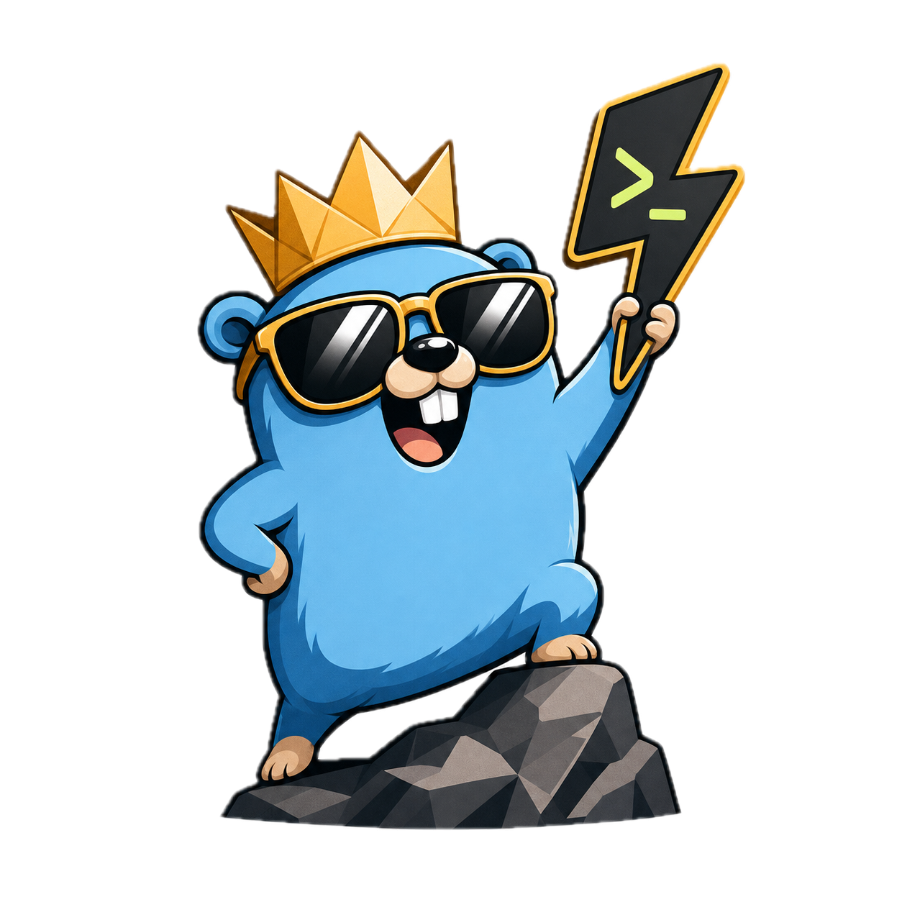

<p align="center">
  
</p>

# Godex

Godex is an independent Codex plugin for Go backend engineering.

It gives backend agents a compact, production-minded skill for building, reviewing, testing, debugging, and maintaining Go services. It is not an official Go, OpenAI, or Codex plugin.

## Getting Started

Add the GitHub repo as a Codex plugin marketplace, then install Godex:

```bash
codex plugin marketplace add parmcoder/godex
codex plugin add godex@godex
codex plugin list
```

Use a new Codex thread after installing so the `godex-go-backend` skill is loaded.

## Use

Invoke the skill when working on Go backend code:

```text
Use $godex-go-backend to review this Go service for production readiness.
Use $godex-go-backend to plan adding a pgx repository with tests.
Use $godex-go-backend to add Kubernetes-friendly health, readiness, and metrics endpoints.
```

## Focus

Godex covers:

- idiomatic Go, package boundaries, YAGNI, and composition-first design
- `gopls`-driven navigation before editing
- `net/http` first, with `gin` only when a framework is justified
- `/healthz`, `/readyz`, and `/metricz` endpoints for Kubernetes probes
- `log/slog`, OpenTelemetry, Jaeger, request IDs, and trace IDs
- `github.com/caarlos0/env`, YAML config for complex cases, and fail-fast validation
- `pgx`, `go-redis`, IBM Sarama, Swagger via `swaggo/swag`, Google Wire, mockery, Taskfile, Air, and Delve

Existing project conventions win when they are already clear and production-grade.

## License

Apache-2.0. See `LICENSE`.

## Contributing

Keep contributions focused on Go backend engineering. Avoid company-specific code, private examples, and broad scaffolding that should live in a project template instead of a skill.
